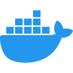

# Docker and Kafka Quickstarts

[Base](#base) • [Kafka Connect](#kafka-connect) • [Schema Registry](#schema-registry)

Set of Docker Compose environments around Kafka.

## Prerequisites

- Docker

## Quickstarts

### AKHQ

| Module                                         | Description                                                                                |
|------------------------------------------------|--------------------------------------------------------------------------------------------|
| [Base](/akhq/base)                             | KRaft broker, AKHQ                                                                         |
| [Schema Registry](/akhq/schema-registry)       | KRaft broker, AKHQ, Schema Registry                                                        |
| [Connect](/akhq/kafka-connect)                       | KRaft broker, AKHQ, Schema Registry, Kafka Connect                                         |
| [ACLs SCRAM-SHA-512](/akhq/acls-scram-sha-512) | KRaft broker (ACLs and SCRAM-SHA-512 authentication), AKHQ, Schema Registry, Kafka Connect |

### Base

| Module        | Description                  |
|---------------|------------------------------|
| [Base](/base) | KRaft broker, Control Center |

### Kafka Connect

| Module                                                  | Description                                                                                                                 |
|---------------------------------------------------------|-----------------------------------------------------------------------------------------------------------------------------|
| [Base](/kafka-connect/base)                             | KRaft broker, Control Center, Schema Registry, Kafka Connect                                                                |
| [ACLs SCRAM-SHA-512](/kafka-connect/acls-scram-sha-512) | KRaft broker (ACLs and SCRAM-SHA-512 authentication), Control Center, Schema Registry, Kafka Connect                        |
| [Datagen](/kafka-connect/connectors/datagen)            | KRaft broker (ACLs and SCRAM-SHA-512 authentication), Control Center, Schema Registry, Kafka Connect with Datagen connector |
| [JDBC Sink](/kafka-connect/connectors/jdbc-sink)        | KRaft broker (ACLs and SCRAM-SHA-512 authentication), Control Center, Schema Registry, Kafka Connect with JDBC connector    |

### Schema Registry

| Module                                                    | Description                                                                           |
|-----------------------------------------------------------|---------------------------------------------------------------------------------------|
| [Base](/schema-registry/base)                             | KRaft broker, Control Center, Schema Registry                                         |
| [ACLs SCRAM-SHA-512](/schema-registry/acls-scram-sha-512) | KRaft broker (ACLs and SCRAM-SHA-512 authentication), Control Center, Schema Registry |
